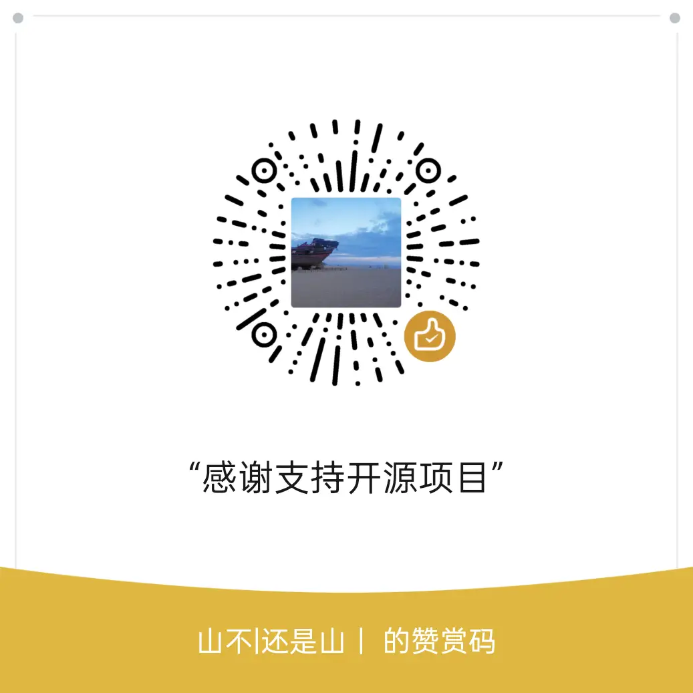

# 支持 Stock Analysis Skill

如果这个 Skill 帮你：

- 少追一次高估值泡沫；
- 少忽略一次现金流风险；
- 更清楚地看懂一家公司当前市值隐含的未来预期；
- 搭建起自己的 AI 投研工作流；

欢迎请我喝杯咖啡。

你的支持会用于：

- 持续维护分析模板；
- 补充行业关键因子；
- 增加更多 A 股案例；
- 后续开发 AkShare 半自动取数脚本；
- 改进面向 Codex、Claude Code、OpenAI Agents 的安装体验。

## GitHub Sponsors

如果 GitHub Sponsors 可用，可以点击仓库右上角的 `Sponsor` 按钮支持维护。

## 微信 / 支付宝

> 建议：上传前检查二维码图片，不要暴露手机号、真实姓名、账户余额等敏感信息。

## 国内用户说明

如果 GitHub Sponsor Button 对你不方便，可以通过微信或支付宝打赏。  
金额随意，重点是让这个项目能持续迭代。

## 合规提醒

本项目只提供投研框架、模板和 AI Agent 工作流，不提供任何确定收益承诺。  
打赏是对开源维护工作的自愿支持，不是投资咨询服务费用。
